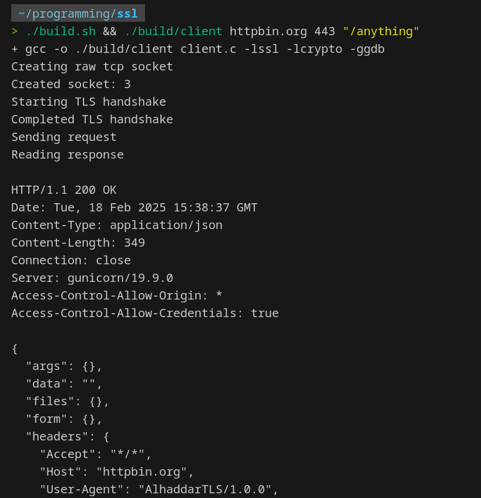

# Demo HTTP TLS Client & Server
This is a demo client and server implemented in C to further understand how the tech works on a deeper level.

> [!CAUTION]
> This project is incomplete and not intended for production use.

## How to compile
```sh
./build.sh
```

## Client Usage
```sh
./build/client <host> <port> <path>
./build/client httpbin.org 443 "/anything"
```



## Server Usage
TODO

# Author
Mohammad Alhaddar

# License
MIT