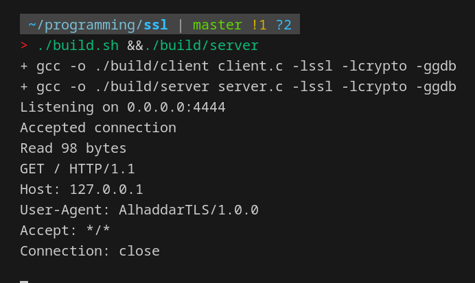

# Demo HTTP TLS Client & Server
This is a demo client and server implemented in C to further understand how the tech works on a deeper level.

> [!CAUTION]
> This project is incomplete and not intended for production use.

## How to compile
```sh
./build.sh
```

## Client Usage
```sh
./build/client <host> <port> <path>
./build/client httpbin.org 443 "/anything"
```


## Server Usage
./build/server



## How did i generate the keys
```sh
# Private key
openssl genrsa -out ./keys/private.key

# Certificate signing request (CSR)
openssl req -new -key ./keys/private.key -out ./keys/request.csr

# Self-signed certificate
openssl x509 -req -days 365 -in ./keys/request.csr -signkey ./keys/private.key -out ./keys/certificate.crt
```

# Author
Mohammad Alhaddar

# License
MIT